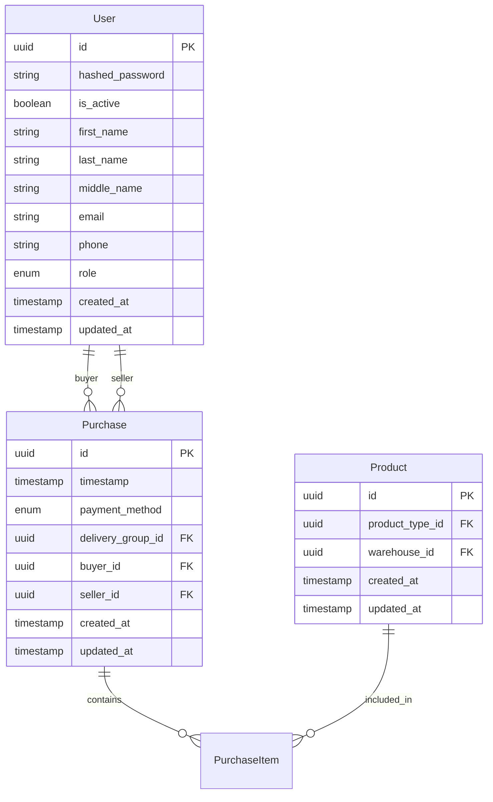

# 📚 Books Store

A modern, microservice-based book store platform built with FastAPI, featuring JWT authentication, PostgreSQL database, and containerized deployment. This project serves as a comprehensive learning platform for SQLAlchemy ORM, microservices architecture, and modern Python development practices.


## 🎯 Project Overview

Books Store is a distributed microservice application designed to demonstrate modern backend development practices. The platform provides a complete e-commerce solution for book management, featuring user authentication, product catalog, order processing, and delivery tracking.

### Key Features

- 🔐 **Secure Authentication**: JWT-based authentication with session management
- 📦 **Microservices Architecture**: Scalable, maintainable service separation
- 🗄️ **Advanced Database Design**: PostgreSQL with SQLAlchemy ORM
- 🚀 **High Performance**: Async/await patterns throughout
- 🐳 **Containerized Deployment**: Docker and Docker Compose ready
- 📊 **Monitoring Ready**: Health checks and logging integration
- 🔄 **Database Migrations**: Alembic for schema management

## 🏗️ Architecture

The application follows a microservices architecture pattern with clear separation of concerns:

```
┌─────────────┐    ┌─────────────┐    ┌─────────────┐
│   Client    │───▶│    Nginx    │───▶│   Gateway   │
└─────────────┘    └─────────────┘    └─────────────┘
                                              │
                    ┌─────────────┐    ┌─────┴─────┐
                    │  Authorizer │◀───┤   Server   │
                    └─────────────┘    └───────────┘
                            │                │
                    ┌───────┴───────┐  ┌────┴────┐
                    │    Valkey     │  │PostgreSQL│
                    │   (Sessions)  │  │ (Data)   │
                    └───────────────┘  └─────────┘
```

### Service Responsibilities

- **Nginx**: Reverse proxy and load balancer
- **Gateway**: API gateway with JWT middleware and routing
- **Authorizer**: User authentication, registration, and session management
- **Server**: Core business logic (users, products, orders, deliveries)
- **Valkey**: Session storage and caching
- **PostgreSQL**: Primary data storage

## 🛠️ Tech Stack

### Backend Technologies

- **Python 3.11+** with async/await support
- **FastAPI** for high-performance API development
- **SQLAlchemy 2.0** with async ORM
- **Pydantic** for data validation and serialization
- **Alembic** for database migrations
- **bcrypt** for password hashing
- **python-jose** for JWT token handling

### Infrastructure

- **Docker** and **Docker Compose** for containerization
- **PostgreSQL 15** as the primary database
- **Valkey** (Redis-compatible) for session storage
- **Nginx** as reverse proxy
- **Uvicorn** as ASGI server

### Development Tools

- **Black** for code formatting
- **isort** for import sorting
- **Ruff** for linting
- **MyPy** for type checking
- **pytest** for testing

## 🚀 Quick Start

### Prerequisites

- **Docker** and **Docker Compose**
- **Git** for version control
- **Python 3.11+** (for local development)

### Installation

1. **Clone the Repository**
   ```bash
   git clone https://github.com/your-username/books_store.git
   cd books_store
   ```

2. **Set Up Environment Variables**
   ```bash
   cp .env.example .env
   # Edit .env with your configuration
   ```

3. **Start the Application**
   ```bash
   docker-compose up --build
   ```

4. **Verify Installation**
   ```bash
   # Check service status
   docker-compose ps
   
   # Access the API
   curl http://localhost:8000/
   ```

### Environment Configuration

Create a `.env` file with the following variables:

```env
# Project Configuration
COMPOSE_PROJECT_NAME=books_store
DOCKER_CONTAINERS_RESTART=unless-stopped

# Nginx Configuration
NGINX_PORT=80
NGINX_HOST=localhost

# Gateway Configuration
GATEWAY_PORT=8000
GATEWAY_HOST=0.0.0.0

# Authorizer Configuration
AUTHORIZER_PORT=8001
AUTHORIZER_HOST=0.0.0.0

# Server Configuration
SERVER_PORT=8002
SERVER_HOST=0.0.0.0

# PostgreSQL Configuration
POSTGRES_PORT=5432
POSTGRES_HOST=postgres
POSTGRES_USER=postgres
POSTGRES_PASSWORD=your_password
POSTGRES_DB=books_store

# Valkey Configuration
VALKEY_PORT=6379
VALKEY_HOST=valkey

# JWT Configuration
JWT_SECRET_KEY=your_secret_key
JWT_ALGORITHM=HS256
ACCESS_TOKEN_EXPIRE_MINUTES=30
REFRESH_TOKEN_EXPIRE_DAYS=7
```

## 📚 API Documentation

### Authentication Endpoints

| Method | Endpoint | Description |
|--------|----------|-------------|
| `POST` | `/users/register` | Register a new user |
| `POST` | `/users/login` | Authenticate user |
| `POST` | `/users/logout` | Logout user |
| `POST` | `/users/refresh` | Refresh access token |

### User Management

| Method | Endpoint | Description |
|--------|----------|-------------|
| `GET` | `/users/` | Get all users |
| `GET` | `/users/{user_id}` | Get user by ID |
| `POST` | `/users/` | Create new user |
| `PATCH` | `/users/{user_id}` | Update user |
| `DELETE` | `/users/{user_id}` | Delete user |

### Author Management

| Method | Endpoint | Description |
|--------|----------|-------------|
| `GET` | `/authors/` | Get all authors |
| `GET` | `/authors/{author_id}` | Get author by ID |
| `POST` | `/authors/` | Create new author |
| `PATCH` | `/authors/{author_id}` | Update author |
| `DELETE` | `/authors/{author_id}` | Delete author |

### Delivery Groups

| Method | Endpoint | Description |
|--------|----------|-------------|
| `GET` | `/delivery_groups/` | Get all delivery groups |
| `GET` | `/delivery_groups/{id}` | Get delivery group by ID |
| `POST` | `/delivery_groups/` | Create new delivery group |
| `PATCH` | `/delivery_groups/{id}` | Update delivery group |
| `DELETE` | `/delivery_groups/{id}` | Delete delivery group |

## 🗄️ Database Schema

### Core Entities



### Key Features

- **UUID Primary Keys**: All entities use UUID primary keys
- **Timestamps**: Automatic created_at and updated_at tracking
- **Soft Deletes**: Support for soft deletion patterns
- **Enum Types**: PostgreSQL enums for status and role fields
- **Relationships**: Comprehensive foreign key relationships

## 🔧 Development

### Local Development Setup

1. **Install Dependencies**
   ```bash
   # For each service
   cd server && pip install -r requirements.txt
   cd ../authorizer && pip install -r requirements.txt
   cd ../gateway && pip install -r requirements.txt
   ```

2. **Database Setup**
   ```bash
   # Start PostgreSQL
   docker run -d --name postgres-dev \
     -e POSTGRES_DB=books_store \
     -e POSTGRES_USER=postgres \
     -e POSTGRES_PASSWORD=password \
     -p 5432:5432 postgres:15
   
   # Run migrations
   cd alembic_migrations
   alembic upgrade head
   ```

3. **Run Services**
   ```bash
   # Terminal 1 - Server
   cd server && python main.py
   
   # Terminal 2 - Authorizer
   cd authorizer && python main.py
   
   # Terminal 3 - Gateway
   cd gateway && python main.py
   ```

### Code Quality

```bash
# Format code
black .
isort .

# Lint code
ruff check .
ruff check --fix .

# Type checking
mypy .

# Run tests
pytest
```

### Database Migrations

```bash
cd alembic_migrations

# Create new migration
alembic revision --autogenerate -m "Description of changes"

# Apply migrations
alembic upgrade head

# Rollback migration
alembic downgrade -1
```

## 🧪 Testing

### Running Tests

```bash
# Install test dependencies
pip install pytest pytest-asyncio pytest-cov

# Run all tests
pytest

# Run with coverage
pytest --cov=src --cov-report=html

# Run specific test file
pytest tests/test_user_router.py

# Run with verbose output
pytest -v
```

### Test Structure

```
tests/
├── conftest.py          # Test configuration and fixtures
├── test_user_router.py  # User endpoint tests
├── test_auth_service.py # Authentication tests
└── integration/         # Integration tests
    ├── test_database.py
    └── test_api.py
```

## 📊 Monitoring and Health Checks

### Health Endpoints

- **Gateway**: `GET /health`
- **Authorizer**: `GET /health`
- **Server**: `GET /health`

### Logging

The application uses structured logging with Loguru:

```python
from loguru import logger

logger.info("Service started successfully")
logger.error("Database connection failed", error=str(e))
```

### Metrics

- Request/response times
- Database query performance
- Error rates and types
- Service availability

## 🚀 Deployment

### Docker Deployment

```bash
# Build and start all services
docker-compose up --build -d

# View logs
docker-compose logs -f

# Stop services
docker-compose down
```

### Production Considerations

- **Environment Variables**: Use proper secret management
- **Database**: Configure connection pooling and backups
- **Monitoring**: Set up Prometheus and Grafana
- **Security**: Enable HTTPS, rate limiting, and CORS
- **Scaling**: Use Kubernetes for orchestration

## 🤝 Contributing

We welcome contributions! Please see our [Contributing Guide](CONTRIBUTING.md) for details on:

- Development setup
- Code standards
- Testing guidelines
- Pull request process
- Bug reporting

## 📄 License

This project is licensed under the MIT License - see the [LICENSE](LICENSE) file for details.

## 🙏 Acknowledgments

- **FastAPI** team for the excellent framework
- **SQLAlchemy** team for the powerful ORM
- **Pydantic** team for data validation
- **Docker** team for containerization tools

## 📞 Support

- **Issues**: [GitHub Issues](https://github.com/your-username/books_store/issues)
- **Discussions**: [GitHub Discussions](https://github.com/your-username/books_store/discussions)
- **Documentation**: [Wiki](https://github.com/your-username/books_store/wiki)

---

<div align="center">
  <p>Made with ❤️ by the Books Store Team</p>
  <p>
    <a href="https://github.com/your-username/books_store/stargazers">
      
    </a>
    <a href="https://github.com/your-username/books_store/network">
      
    </a>
    <a href="https://github.com/your-username/books_store/issues">
      
    </a>
  </p>
</div>